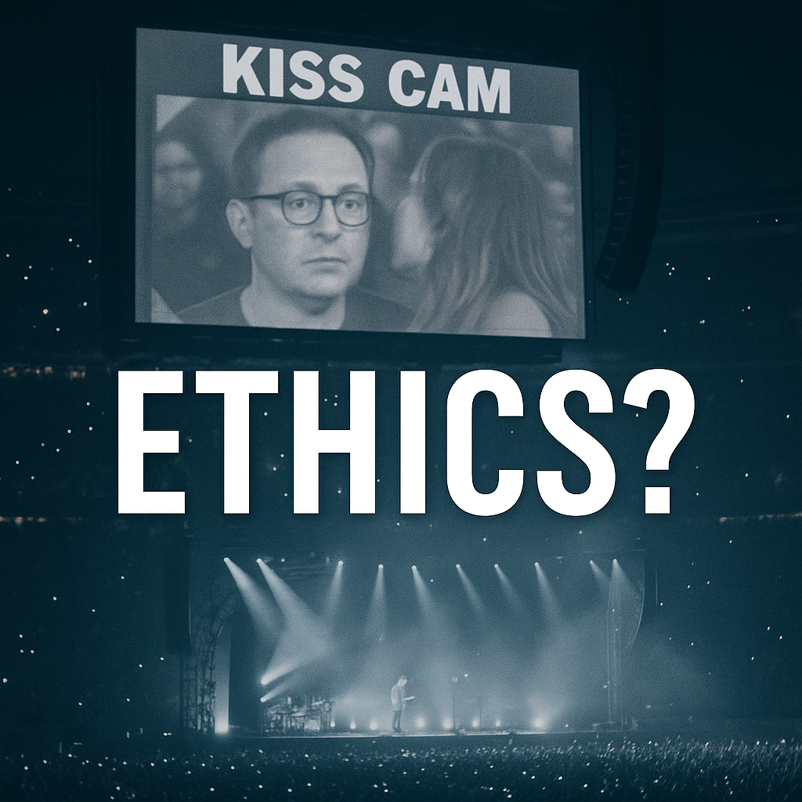

# Coldplay Kiss-Cam Scandal: A UX Ethics Case Study

## Executive Summary
**Logged:** July 2025  
**Overview:** A viral kiss-cam moment raised questions about UX, ethics, and audience behavior.  
**Format:** A brief reflection on digital culture and product signals.  
**Tags:** Product culture • UX ethics • Audience behavior • Virality  
**Trigger event:** A moment from a Coldplay concert went viral, sparking public debate and digital scrutiny.

**_Disclaimer_**:
>**_This document is a learning artifact created for educational and reflective purposes. It does not name or analyze the individuals featured in the viral clip, even though their identities were made public. The focus is strictly on product design, platform responsibility, and digital ethics, highlighting how real-world viral events shape public trust, user privacy, and product accountability._**

## Exploring Audience Privacy, Platform Responsibility, and Viral Amplification

This case study analyzes a real-world viral event; the Coldplay 2025 concert “kiss-cam” incident through the lens of product design, digital ethics, and platform accountability. It unpacks how human behavior, content virality, and UI/UX choices can intersect to either protect or exploit personal privacy in public spaces.

## What Happened

During a Coldplay concert in mid-2025, an alleged couple featured on the audience kiss cam appeared visibly uncomfortable. Chris Martin, the lead singer, made a lighthearted comment joking about the situation, which drew laughter from the crowd.

The moment quickly went viral online, sparking widespread speculation about their relationship. Viewers shared commentary across social media platforms, and discussions about their identities and the context raised questions about privacy and public perception.

## Why this Case Matters

This moment raises important questions about product design, ethics, and digital culture:

- How should cameras at public events be designed to avoid causing harm, especially during sensitive emotional moments?  
- What responsibilities do product teams have to anticipate risks when technology interacts with human behavior?  
- How can brands be accountable for third-party technologies used in their experiences?  
- What role do platforms and audiences play in respecting privacy when personal moments go viral?

At its core, this case shows how digital tools can blur the lines between private and public life, and why ethical foresight in product design is essential.

##  Key Observations

The Coldplay kiss-cam incident highlights important product, UX, and ethical lessons:

| **Product Element**     | **Incident Detail**                                                                                     | **Product and UX Insight**                                                                      |
|-------------------------|----------------------------------------------------------------------------------------------------------|-----------------------------------------------------------------------------------------------|
| **Camera feature** | A man and woman were shown on the stadium kiss cam during a Coldplay concert, appearing uncomfortable and without clear consent | Live event tools like kiss cams must include opt-out, delay, or explicit consent mechanisms to protect attendee privacy. |
| **Platform algorithm**  | The clip amassed over **50 million views on TikTok** and X within days   | Engagement-driven algorithms can push emotionally intense content fast, often before proper context is available. |
| **Reaction tools**      | The clip was widely reshared, reposted, remixed, and reacted to by users | Reaction and remix features can accelerate misinterpretations, adding friction or context prompts may help slow harmful spread. |
| **Content moderation**  |  No visible intervention by TikTok or X occurred during the initial surge of the viral clip | Platforms need real-time monitoring and escalation processes for high‑impact viral content. |

###  Ethical Takeaway

This case shows that even public moments can cross ethical lines when consent, context, and emotional sensitivity are missing. Users responded with empathy and mockery revealing how product design shapes public perception and behavior.

##  Public Reaction Themes
- **Outrage and speculation**: The individuals featured in the viral clip faced swift online backlash. Many users speculated about a possible affair, questioned the ethics of their professional relationship, and fueled a narrative without full context.
- **Memes and humor**: The clip quickly became meme material, with mascot reenactments, parody videos, and jokes spreading across TikTok, Reddit, and late-night shows. A personal moment was reshaped into public entertainment.
- **Ethical debate**: The incident sparked deeper conversations about digital privacy, audience consent, and the blurry line between fun and public shaming in viral culture.

##  Reflections for Product Thinkers

Questions worth asking:

- Should platforms promote or suppress sensitive content captured in public when it has private implications?
- Could live event systems (like kiss cams) include consent features such as opt-outs, delay screens, or wristband tagging?
- What role should platforms and creators have in protecting individuals unexpectedly thrust into the spotlight?
- Can product design introduce friction such as context reminders or disclaimers to reduce mass misjudgment and misinformation?

##  Insights for Product and UX Teams

| Area                      | Insight                                              | Recommendation                                                                 |
|---------------------------|------------------------------------------------------|--------------------------------------------------------------------------------|
| Intent vs impact          | An event meant for entertainment resulted in public shaming | Test features against emotional edge cases before launch               |
| Passive consent assumption| Being in public or on camera does not equal consent  | Build explicit opt-in/opt-out mechanisms for live filming                      |
| Shared accountability     | Astronomer’s internal statement focused on leadership accountability and ethics | Brands and vendors should co-own responses and communicate transparently in public incidents |

##  Lessons for Product, Media and Content Teams

_These insights are based on my synthesis of the Coldplay Kiss-Cam saga, with attention to user privacy, viral dynamics, brand ethics, and the product decisions that shaped public perception._

-  **Design with consent at the core**: Public-facing features must treat visibility and exposure as user choices, not defaults.

- **Virality isn’t neutral**: Just because a feature can “go viral” doesn’t mean it should. Map potential harm alongside potential reach.

- **Ethics as an  afterthought**: Ethical thinking should be embedded from ideation through deployment, especially in emotionally charged contexts.

- **PR and product fix**: A vague apology can’t undo harm caused by bad product decisions. Accountability must be proactive and systemic.

- **Blame games hurt trust**: Shifting responsibility to vendors or tech partners dilutes credibility. Own the outcome.

##  Product Lessons for Future Design

_Quick-reference checklist for PMs, designers, and engineers._

### ✅ Do:
- Include **edge-case emotional risk mapping** in product reviews  
- Build **opt-in visibility** features for public-facing experiences  
- Treat **ethical design** as a first-class requirement  

### ❌ Don’t:
- Assume **silence = comfort with exposure**  
- Outsource risk to **third-party tools** without ethical alignment  
- Ignore **real-world harm** just because something “went viral”  

##  Personal Reflection

If I were working on TikTok, Instagram, or other live-event platforms going forward, I’d conside:

- **Context-flagging layers**: AI-driven prompts could be added when videos include ambiguous or emotionally charged footage
- **Pause-and-reflect rollouts**: A short delay or confirmation step before sharing emotionally sensitive clips, especially after content  reached 50+ million views, as seen in the Coldplay clip
- **Audience consent UX**: Event tools could include default opt-outs or “no-cam” markers, noting that subjects were visibly uncomfortable on-camera
These proposals are centered on preserving dignity in a digital environment that prizes virality.

###  Guidance for Creators and Analysts

- Study audience behavior, platform incentives, and content ethics  
- Refrain from naming individuals unless stated by trusted public sources 
- Focus analysis on **UX, design decisions, and systemic responsibility** rather than sensational headlines

##  Final Reflection

Product and content decisions are never neutral. From camera workflows and event design to vendor oversight and crisis communication, every choice drives human consequences.  
In this case, a private moment became public content, and dignity became collateral.  

Let’s build better.

**If this happened on your platform, how would your team respond?**

## Tags
#Productethics #UXdesign #Digitalbehavior #PrivacyandAI #Platformaccountability #Viralcontentanalysis #Coldplaycase2025

## References

- Business Insider. (2025, July 17). *TikTok users react to Coldplay concert kiss-cam clip*. [(Business Insider, Jul 17 2025)](https://www.businessinsider.com/astronomer-andy-byron-viral-kiss-cam-coldplay-public-relations-marketing-2025-7)    
- ABC News. (2025, July 18). *Coldplay concert kiss-cam moment goes viral*. [(ABC News, Jul 18 2025)](https://abcnews.go.com/GMA/Culture/coldplay-concert-kiss-cam-moment-viral-chris-martin/story?id=123863240)   
- WCVB. (2025, July 18). *Gillette Stadium kiss-cam celebrity clarified*.  [(WCVB, Jul 18 2025)](https://www.wcvb.com/article/gillette-stadium-coldplay-concert-kiss-cam-viral-video-astronomer-ceo-resigns/65454732)

- Washington Post. (2025, July 18). *Viral video and questions on digital consent*. [(Washington Post, Jul 18 2025)](https://www.washingtonpost.com/technology/2025/07/18/andy-byron-coldplay-concert-privacy-astronomer-ceo/)
  
- Reuters. *CEO of Astronomer resigns after viral kiss-cam clip.* July 19, 2025. [(Reuters, Jul 19 2025)](https://www.reuters.com/technology/ceo-astronomer-resigns-after-viral-kiss-cam-video-2025-07-19/)  

